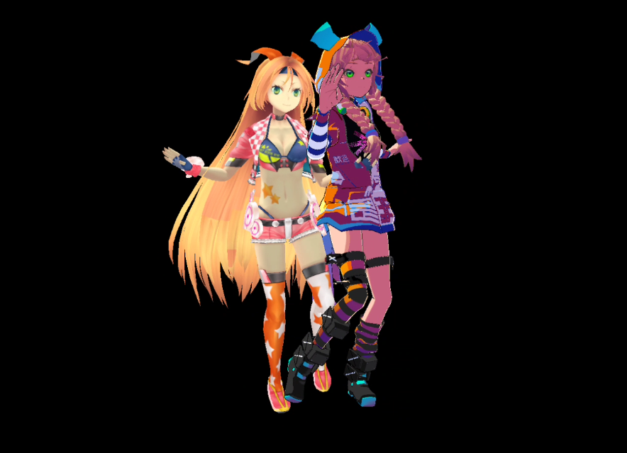
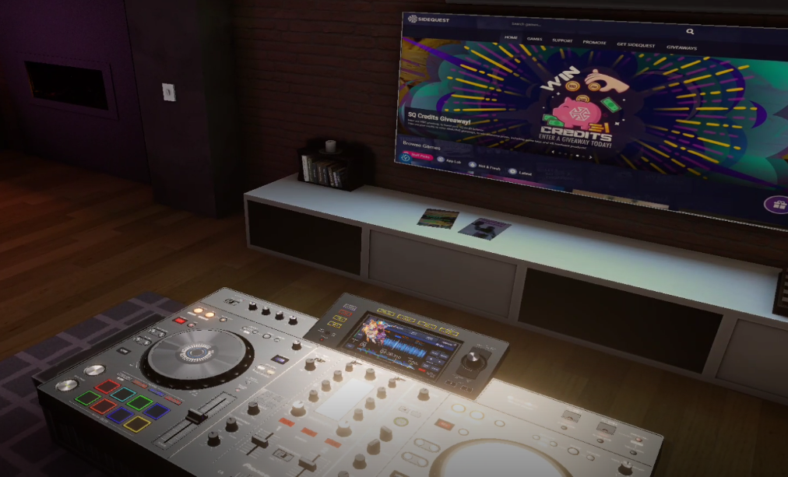
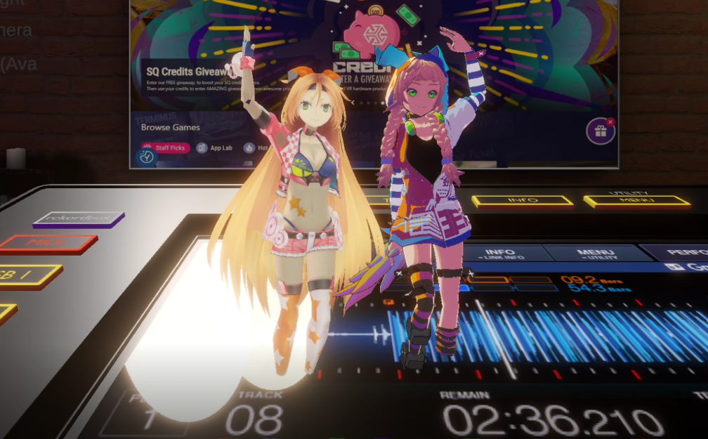

[English Document](README.md)

# 概览

BVA是一个基于GLTF标准，跨平台的格式。这个格式可以被很多工具支持，比如游戏引擎，Babylon.js，Maya，Blender。3D数据以标准GLTF的形式存在，其他的信息以BVA扩展和额外的信息进行存储，所以它并没有破坏文件标准，并且这个将会一直作为一个设计更新的传统，以便其能够被Windows的3D查看器，Babylon.js，主流建模软件等直接打开使用。

> 任何支持GLTF的工具同样支持查看或编辑BVA的3D数据部分。

技术上，它可以存储任意类型的信息，比如多媒体，动画片段，自定义数据，甚至是脚本。目前可以在直播开播中作为开播资源的文件，游戏或者社交应用的avatar，尤其是VR类应用，还有像虚拟会议等需要化身的场景，以及可以基于这个开发类似MMD的制作虚拟人视频的工具，虚拟偶像等，跟虚拟场景和用户内容生成相关的都可以集成到应用中使用。

长远看，它也许能够帮助你去创建类似元宇宙的游戏比如Roblox，脚本系统已经在开发路线中。

# 安装

## 系统要求

- Unity 2020.3 或更高，最优版本 - 2021.3 LTS

## 编译平台

- 桌面 (Windows10 测试通过, Mac 或 Linux 应该也没问题)
- Android(vulkan 或 gles3.0 并且线性贴图必须要被支持)
- iOS 10 或更新
- WebGL (在 Unity 2021 之后的版本中可以，未做测试)

## 示例打包要求

所有的示例位于 `Assets/BVA/Samples`

- Windows10 或更高
- MacOS
- Android 或 iOS(当前只有 `WebLoad` 可以打包通过, SFB文件选择界面只支持桌面端)

获取更多信息请点击这里 [入门](docs/Get_Start.zh.md)

> 重要事项：
- 除了WebLoad这个范例，其余的范例都使用了FileDialog(SFB)，在Windows上，它使用了WinForm，所以使用IL2CPP 编译的时候会失败，使用Mono以便通过编译。
- ManagerScriptStriping需要禁用，I18N.CKJ没有被任何地方引用，但是GetEncoding依赖与它。 
- Shader那块不应该裁剪Post Processing Variants。
- WebLoad 可以打包到 Android & iOS上运行。

# 手册

- [入门](docs/Get_Start.zh.md)
- [角色配置](docs/work/Avatar.zh.md)
- [场景配置](docs/work/Scene.zh.md)
- [工具](docs/tools/Tools.zh.md)

# 示例

- [浏览文件](docs/examples/FileViewer.md)
- [运行时加载 BVA,GLB,VRM,PMX](docs/examples/RuntimeLoad.md)
- [从URL加载BVA文件](docs/examples/WebLoad.md)
- [运行时导出](docs/examples/RuntimeExport.md)
- [单个文件加载多个场景](docs/examples/MultipleScenePayload.md)
- [配置角色换装方案](docs/examples/AvatarConfig.md)
- [BVA能力测试](https://github.com/625673575/BVATest)

# 使用 UnityBVA SDK

作为一个兼容GLTF的文件格式，BVA可以在不同引擎版本，不同的打包平台下跨平台加载，这极大的方便了开发者创建UGC（用户内容生产）。毕竟，创建这样一个文件格式需要花费很大的精力，并且完善其工具链生态需要付出更多的努力。

- [编辑器下导出](docs/work/Export.md)
- [编辑器下导入](docs/work/Import.md)
- [代码使用](docs/work/programing/Programing.md)
- [物理配置](docs/work/physics/Automatic-Dynamic-Bone-Tutorial.zh.md)

# 功能

我们相信，在未来十年，UGC将席卷整个游戏或虚拟人相关行业，我们鼓励每个人都去创作内容，释放想象力和创造力。
BVA提供统一的角色模型规范，、面部和运动捕捉标准，以更好地适应模型，它还可以应用于需要化身的VR游戏，单个文件可以提供电影动作，角色、场景、照明、多媒体等系统，所有这些内容集中在一个文件中，无需额外附加配置，而且它是**跨平台以及版本兼容性，您不必使用特定版本的Unity引擎**（这是AssetBundle最大的应用问题）

它提供了一个非常高效的动态骨骼系统，支持并行计算，通过利用Unity的作业系统和突发编译器来创建高效代码。([Automatic-DynamicBone by OneYoungMan](https://github.com/OneYoungMean/Automatic-DynamicBone))

- Export Avatar & Scene (editor full ability & runtime partial ability)
- Import VRM & MMD model as Prefab in Editor
- Runtime Load Avatar & Scene
- Runtime Load VRM & MMD model
- Collider & Camera & Light
- Avatar
- Cubemap Texture(vertical & horizontal & panorama 360)
- Skybox(6 sided textures & cubemap)
- Lightmap
- Text Mesh
- Decal Projector
- Audio (wav & ogg format)
- VidioPlayer (URL only)
- Face & Motion Capture Compatible(BlendshapeMixer)
- LookAt (eye follwing a target)
- AutoBlink (auto blink eyes)
- Reflection Probe(Custom Texture & Realtime)
- Generic Transform & Blendshape Animation, Humanoid Avatar Animation
- DynamicBone Physics
- PostProcess (`Volume` component in Universal RP)
- Custom Material Import & Export Code Generation
- Component Code Generation (No nested structure)
- RenderSetting

# 第三方BVA相关工具

欢迎提交您开发的相关工具到这里

- [VRM2BVA](https://github.com/625673575/VRM2BVA/releases/tag/binary) - Convert VRM to BVA command line tool

# 第三方库引用

来自开源存储库，但可能已经做了一些修改。感谢以下开源项目。

## DracoUnity
https://github.com/atteneder/DracoUnity

### License
Copyright (c) 2019 Andreas Atteneder, All Rights Reserved. Licensed under the Apache License, Version 2.0 (the "License"); you may not use files in this repository except in compliance with the License. You may obtain a copy of the License at

http://www.apache.org/licenses/LICENSE-2.0

Unless required by applicable law or agreed to in writing, software distributed under the License is distributed on an "AS IS" BASIS, WITHOUT WARRANTIES OR CONDITIONS OF ANY KIND, either express or implied. See the License for the specific language governing permissions and limitations under the License.

### Third party notice
> Builds upon and includes builds of Google's Draco 3D data compression library (released under the terms of Apache License 2.0).

## NAudio
https://github.com/naudio/NAudio

## LiliumToonGraph
https://github.com/you-ri/LiliumToonGraph

## UniVRM
https://github.com/vrm-c/UniVRM

## UniHumanoid
https://github.com/ousttrue/UniHumanoid

## KtxUnity
https://github.com/atteneder/KtxUnity

## UnityGLTF
https://github.com/KhronosGroup/UnityGLTF

## NaughtyAttributes
https://github.com/dbrizov/NaughtyAttributes

## UnityPMXRuntimeLoader
https://github.com/hobosore/UnityPMXRuntimeLoader

## unity-wrapper-vorbis
https://github.com/khindemit/unity-wrapper-vorbis

## shader-variant-explorer
https://github.com/needle-tools/shader-variant-explorer

## UnityIngameDebugConsole
https://github.com/yasirkula/UnityIngameDebugConsole

# 有用的商业资源
- [Animation Converter](https://assetstore.unity.com/packages/tools/animation/animation-converter-107688) Convert animation clips (*.anim) between all 3 animation types (humanoid ⇆ generic ⇆ legacy).

# 开源协议
[Apache License, Version 2.0](License.md)