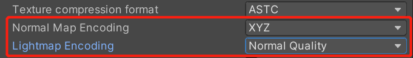
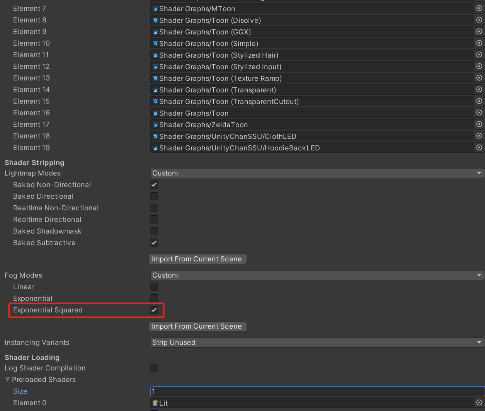

# Get Started with BVA

## System Requirements 

- Unity 2020.3 or later, works best on 2021.3 LTS

## Build Target

- Standalone(Windows10 testified, support Draco)
- Android(vulkan or gles3.0 and linear texture must be supported)
- iOS 10 or later
- WebGL(works fine on Unity 2021 later,not tested)

## Sample Build Requirements

- Windows10 or later
- MacOS
- Android or iOS(only scene `WebLoad` is currently available, OpenFileDialog support standalone platform only)

All examples are located in `Assets/BVA/Samples`:
- [AvatarConfig](../docs/examples/AvatarConfig.md)
- [FileView](../docs/examples/FileViewer.md)
- [MultipleScenePayload](../docs/examples/MultipleScenePayload.md)
- [RuntimeExport](../docs/examples/RuntimeExport.md)
- [RuntimeLoad](../docs/examples/RuntimeLoad.md)
- [WebLoad (support mobile platform)](../docs/examples/WebLoad.md)

## Environment Settings

> Must Meet
***

Uncheck `Assembly Version Validation`

***

Allow `Unsafe Code`

Set `Managed Stripping Level` = `Disabled`

***

Set `ColorSpace` = `Linear`

***

Set `Lightmap Encoding` = `Normal Quality`, Set `Normal Map Encoding` = `XYZ`

## Build Settings

Include `Shaders` or `Shader Variant Collection`

***

Config shader stripping

If your project already integrated `UniVRM`, you need to remove the `VRM` folder under `Third-Party` firstly, then some error might shown up, you need to fix it manually.

# Manuals

- [Avatar Setup](work/Avatar.md)
- [Scene Setup](work/Scene.md)
- [Export](work/Export.md)
- [Import](work/Import.md)
- [Tools](tools/Tools.md)