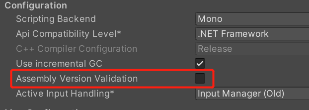
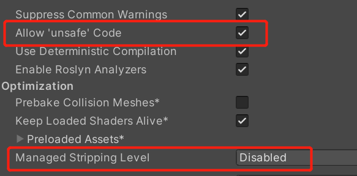
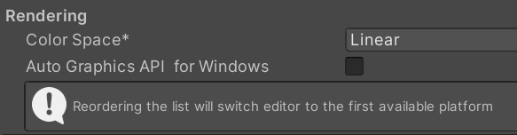

# Get Started with BVA

## Installing BVA

### System Requirements 

- Unity 2020.3 or later, works best on 2021.3 LTS

### Build Target

- Standalone(Windows10 testified, Mac or Linux should also be OK)
- Android(vulkan or gles3.0 and linear texture must be supported)
- iOS 10 or later
- WebGL(works fine on Unity 2021 later,not tested)

## Sample Build Requirements
All examples are located in `Assets/BVA/Samples`

- Windows10 or later
- MacOS
- Android or iOS(only scene `WebLoad` is currently available, OpenFileDialog support standalone platform only)

## Environment Settings

Must Meet:

Disable assembly version validation

allow Unsafe Code

set Managed Stripping Level to `Disabled`

Set `ColorSpace` to Linear 

Build Requirement:

include shaders or shader variant collection 

# Manuals

- [Avatar Setup](work/Avatar.md)
- [Scene Setup](work/Scene.md)
- [Export](work/Export.md)
- [Import](work/Import.md)
- [Tools](tools/Tools.md)