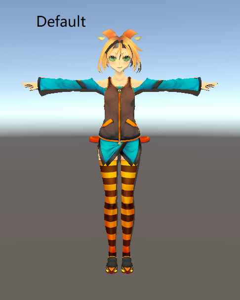
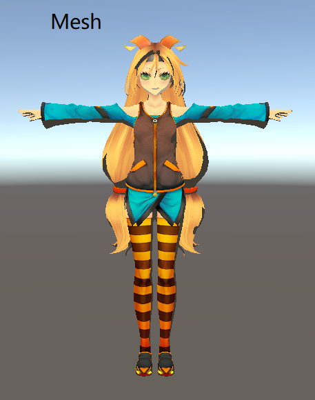
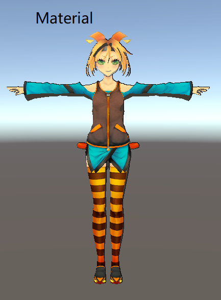
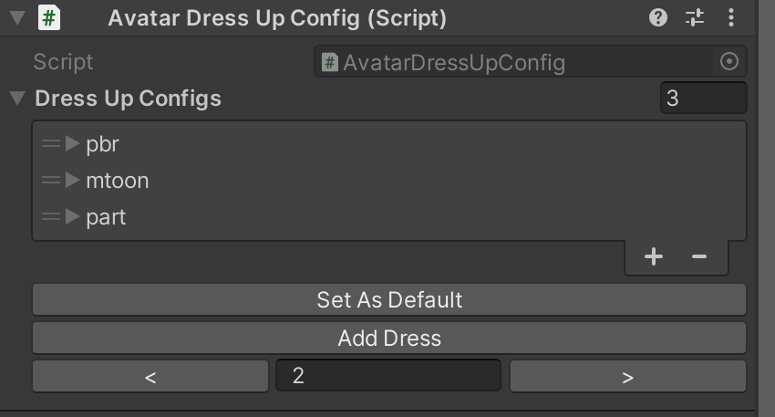

# AvatarConfig

该场景演示了单个文件保存多套换装方案的配置方法

### 支持更换的类型

- 网格，切换不同MeshRenderer的可见性
- 材质，切换不同的材质

### 配置步骤
1. 添加组件`AvatarDressUpConfig`
2. 设置默认的换装方案，点击`Set As Default`
3. 更改Mesh可见性或者材质，点击`Add Dress`添加新的换装方案

