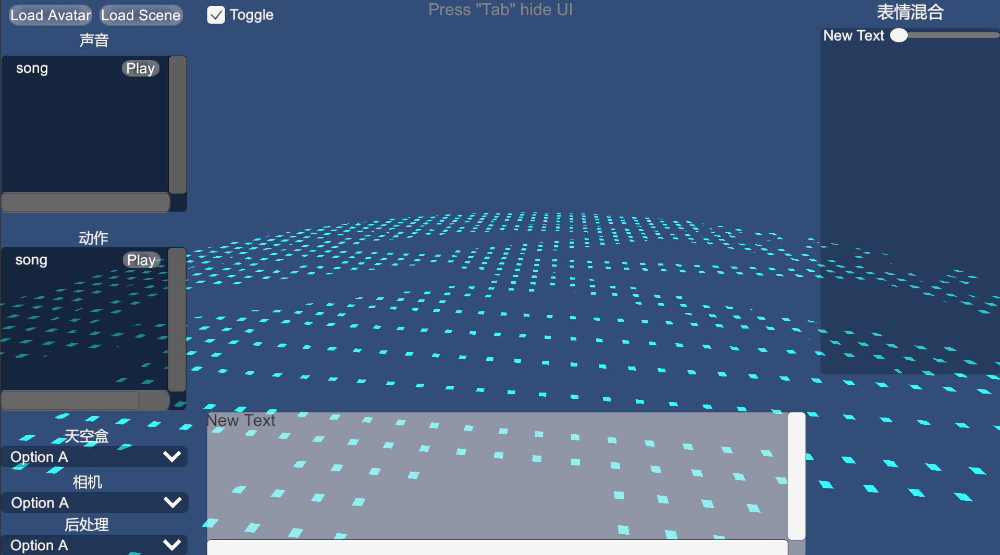
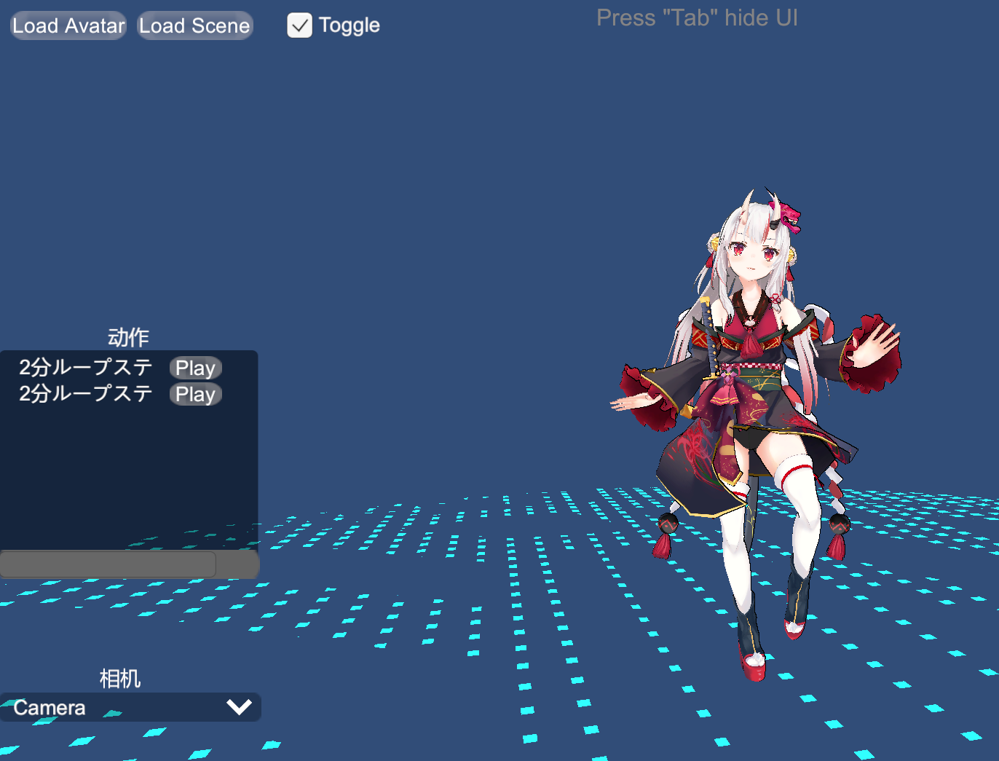

# FileViewer

This scene demonstrates the runtime calls functions, such as loading the scene & avatar, obtaining and utilizing the sound, action, sky box, camera, post-processing, expression mixing and other data contained in the file

### Purposes

- Load Scene
- Load Avatar
- Play Sound
- Play Action
- Switch Skybox
- Switch Camera
- Switch PostProcessing
- Adjust Blendshape