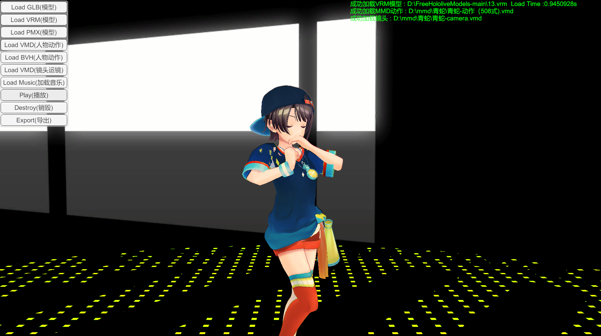

# RuntimeLoad

This scene demonstrates how to load models, character actions, lens actions, etc. at runtime, covering common formats such as this format, MMD, VRM, BVH, VMD, etc

### Functions

- Load BVA,MMD and VRM files at runtime
- Load VMD and BVH motions
- Load VMD camera animation
- Load music
- Export model
- Get loading time

**Notices**

- When exporting a model, you need to ensure that the model is in T-Pose state. When the avatar is playing animation, the exported model will not have the original T-Pose
- when play BVH animations, if there are missing bones, the animation may not play correctly