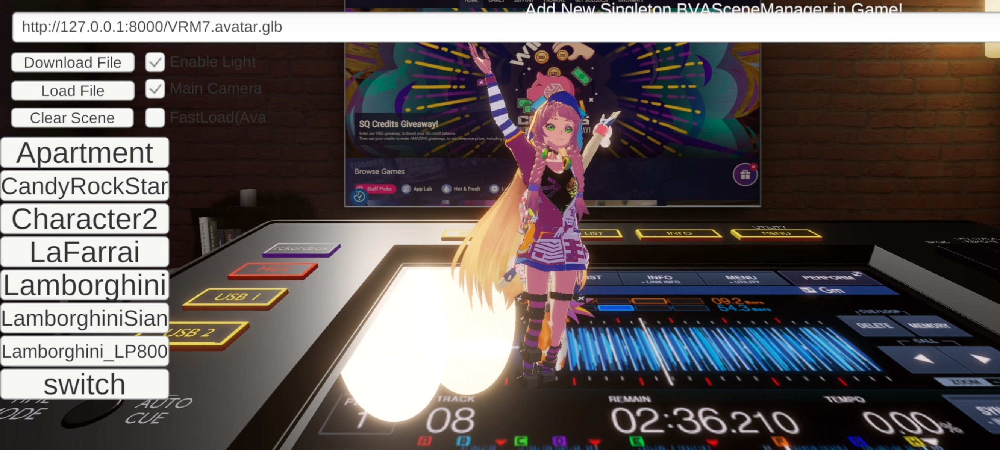

# WebLoad

This scene is mainly used to test the loading performance on mobile devices.

## Functions
- Download File From Web
- Load Model File

## Step
- Run command `python -m http.server 8080` to start a file server
- Copy files inside the file server
- Connect your mobile device to the same local network
- Download File
- Load File