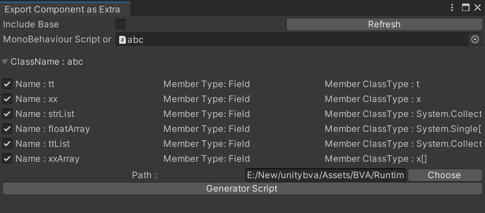

# Component Code Gen for Developer
BVA在设计之初便将扩展性和对开发者的友好视为最高优先级的目标，所以为了让开发者得以导出自定义的组件，同材质代码生成工具一样，我们也为此开发了组件代码生成工具，用于生成序列化和反序列化的代码，以便开发者能快速实现对自定义功能组件的支持。

打开这个工具，可以选择对应的GameObject，然后会出现所有的组件的预览。


或者也可以直接选择对应的脚本到物体上。



选择脚本生成的位置，然后就可以点击生成。

> 目前支持以下种类的数据类型作为基本数据类型导出。Array和List中的元素可以是这些类型，对于自定义类型的类或者结构体。

```csharp
{ bool, byte, short, ushort, int, string, float, double, decimal, LayerMask, Vector2, Vector3, Vector4, Rect, Quaternion, Color, Texture, Material, Sprite, AnimationCurve }
```

选择代码对应的导出位置然后点击`Generate Script`，就会生成一个类以便支持导入和导出。

### 以下是基本的需要被导出序列化和反序列化的组件代码，包含了基本类型的数组和List，结构体，类，并且其数组和类的List和数组。

```csharp
using System.Collections.Generic;
using UnityEngine;
[System.Serializable]
public class t
{
    public int x;
    public Rect rect;
}
[System.Serializable]
public struct x
{
    public string ss;
}
public class abc : MonoBehaviour
{
    public t tt;
    public x xx;
    public List<string> strList;
    public float[] floatArray;
    public List<t> ttList;
    public x[] xxArray;
}
```

### 代码生成器会先针对结构体或者类生成序列化和反序列化的函数，然后在生成组件的导入导出代码

```csharp

namespace GLTF.Schema.BVA
{
    [ComponentExtra]
    public class BVA_abc_Extra : IComponentExtra
    {
        public t tt;
        public x xx;
        public System.Collections.Generic.List<string> strList;
        public float[] floatArray;
        public System.Collections.Generic.List<t> ttList;
        public x[] xxArray;
        public string ComponentName => ComponentType.Name;
        public string ExtraName => GetType().Name;
        public System.Type ComponentType => typeof(abc);
        public void SetData(Component component)
        {
            var target = component as abc;
            this.tt = target.tt;
            this.xx = target.xx;
            this.strList = target.strList;
            this.floatArray = target.floatArray;
            this.ttList = target.ttList;
            this.xxArray = target.xxArray;
        }
        public void Deserialize(GLTFRoot root, JsonReader reader, Component component)
        {
            var target = component as abc;
            while (reader.Read())
            {
                if (reader.TokenType == JsonToken.PropertyName)
                {
                    var curProp = reader.Value.ToString();
                    switch (curProp)
                    {
                        case nameof(target.tt):
                            target.tt = Deserialize_t(root, reader);
                            break;
                        case nameof(target.xx):
                            target.xx = Deserialize_x(root, reader);
                            break;
                        case nameof(target.strList):
                            target.strList = reader.ReadStringList();
                            break;
                        case nameof(target.floatArray):
                            target.floatArray = reader.ReadFloatList().ToArray();
                            break;
                        case nameof(target.ttList):
                            target.ttList = reader.ReadList(() => Deserialize_t(root, reader));
                            break;
                        case nameof(target.xxArray):
                            target.xxArray = reader.ReadList(() => Deserialize_x(root, reader)).ToArray();
                            break;
                    }
                }
            }
        }
        public static t Deserialize_t(GLTFRoot root, JsonReader reader)
        {
            t target = new t();
            reader.Read();
            while (reader.Read() && reader.TokenType == JsonToken.PropertyName)
            {
                var curProp = reader.Value.ToString();
                switch (curProp)
                {
                    case nameof(target.x):
                        target.x = reader.ReadAsInt32().Value;
                        break;
                    case nameof(target.rect):
                        target.rect = reader.ReadAsVector4().ToUnityRectRaw();
                        break;
                }
            }
            return target;
        }
        public static x Deserialize_x(GLTFRoot root, JsonReader reader)
        {
            x target = new x();
            reader.Read();
            while (reader.Read() && reader.TokenType == JsonToken.PropertyName)
            {
                var curProp = reader.Value.ToString();
                switch (curProp)
                {
                    case nameof(target.ss):
                        target.ss = reader.ReadAsString();
                        break;
                }
            }
            return target;
        }
        public static JObject Serialize_t(t input)
        {
            JObject j_input = new JObject();
            j_input.Add(nameof(input.x), input.x);
            j_input.Add(nameof(input.rect), input.rect.ToGltfVector4Raw().ToJArray());
            return j_input;
        }
        public static JObject Serialize_x(x input)
        {
            JObject j_input = new JObject();
            j_input.Add(nameof(input.ss), input.ss);
            return j_input;
        }
        public JProperty Serialize()
        {
            JObject jo = new JObject();
            JObject j_tt = Serialize_t(tt);
            jo.Add(nameof(tt), j_tt);
            JObject j_xx = Serialize_x(xx);
            jo.Add(nameof(xx), j_xx);
            JArray j_strList = new JArray();
            foreach (var item in strList)
                j_strList.Add(item);
            jo.Add(nameof(strList), j_strList);
            JArray j_floatArray = new JArray();
            foreach (var item in floatArray)
                j_floatArray.Add(item);
            jo.Add(nameof(floatArray), j_floatArray);
            JArray j_ttList = new JArray();
            foreach (var item in ttList)
                j_ttList.Add(Serialize_t(item));
            jo.Add(nameof(ttList), j_ttList);
            JArray j_xxArray = new JArray();
            foreach (var item in xxArray)
                j_xxArray.Add(Serialize_x(item));
            jo.Add(nameof(xxArray), j_xxArray);
            return new JProperty(ComponentName, jo);
        }
        public object Clone()
        {
            return new BVA_abc_Extra();
        }
    }
}

```
