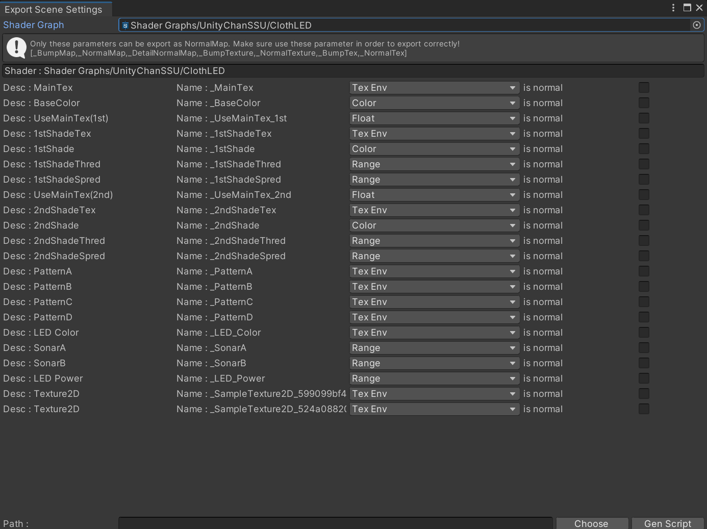

# Material Code Gen for Developer

BVA在设计之初便将扩展性和对开发者的友好视为最高优先级的目标，所以为了让开发者得以使用自定义的Shader，我们开发了一个材质参数代码生成工具，用于生成序列化和反序列化的代码，以便开发者能快速实现对自定义Shader的支持。

打开这个工具，可以选择对应的Shader，然后会出现所有的材质参数的预览，目前对于部分参数做了过滤，这些参数实际上并不需要被导出，而是交由引擎处理。

```csharp
readonly string[] excludedParameters = new string[] { "unity_Lightmaps", "unity_LightmapsInd", "unity_ShadowMasks", "_QueueOffset", "_QueueControl" };
```

选择代码对应的导出位置然后点击`Gen Script`，就会生成一个类以便支持导入和导出。



看一下生成的代码，主要有三个函数，第一个是构造函数，用于初始化要导出的参数的值，第二个Deserialize是反序列化的函数，用于从文件中读取到对应的值，第三个Serialize是序列化函数，用于导出时的参数写入。

```csharp
using Newtonsoft.Json.Linq;
using Newtonsoft.Json;
using GLTF.Extensions;
using BVA.Extensions;
using System.Threading.Tasks;
using UnityEngine;
using Color = UnityEngine.Color;
using Vector4 = UnityEngine.Vector4;

namespace GLTF.Schema.BVA
{
    public class BVA_Material_ClothLED_Extra : MaterialDescriptor
    {
        public const string PROPERTY = "BVA_Material_ClothLED_Extra";
        public const string SHADER_NAME = "Shader Graphs/UnityChanSSU/ClothLED";
        public const string MAINTEX = "_MainTex";
        public const string BASECOLOR = "_BaseColor";
        public const string USEMAINTEXFIRST = "_UseMainTex_1st";
        public const string FIRSTSHADETEX = "_1stShadeTex";
        public const string FIRSTSHADE = "_1stShade";
        public const string FIRSTSHADETHRED = "_1stShadeThred";
        public const string FIRSTSHADESPRED = "_1stShadeSpred";
        public const string USEMAINTEXSECOND = "_UseMainTex_2nd";
        public const string SECONDSHADETEX = "_2ndShadeTex";
        public const string SECONDSHADE = "_2ndShade";
        public const string SECONDSHADETHRED = "_2ndShadeThred";
        public const string SECONDSHADESPRED = "_2ndShadeSpred";
        public const string PATTERNA = "_PatternA";
        public const string PATTERNB = "_PatternB";
        public const string PATTERNC = "_PatternC";
        public const string PATTERND = "_PatternD";
        public const string LEDCOLOR = "_LED_Color";
        public const string SONARA = "_SonarA";
        public const string SONARB = "_SonarB";
        public const string LEDPOWER = "_LED_Power";
        public const string SAMPLETEXTURE2D599099BF4BCA708590264DEFF4B696DBTEXTURE1 = "_SampleTexture2D_599099bf4bca708590264deff4b696db_Texture_1";
        public const string SAMPLETEXTURE2D524A088209439C85B55EBCCAF6795670TEXTURE1 = "_SampleTexture2D_524a088209439c85b55ebccaf6795670_Texture_1";
        public MaterialTextureParam parameter_MainTex = new MaterialTextureParam(MAINTEX);
        public MaterialParam<Color> parameter_BaseColor = new MaterialParam<Color>(BASECOLOR, Color.white);
        public MaterialParam<float> parameter_UseMainTex1st = new MaterialParam<float>(USEMAINTEXFIRST, 1.0f);
        public MaterialTextureParam parameter_1stShadeTex = new MaterialTextureParam(FIRSTSHADETEX);
        public MaterialParam<Color> parameter_1stShade = new MaterialParam<Color>(FIRSTSHADE, Color.white);
        public MaterialParam<float> parameter_1stShadeThred = new MaterialParam<float>(FIRSTSHADETHRED, 1.0f);
        public MaterialParam<float> parameter_1stShadeSpred = new MaterialParam<float>(FIRSTSHADESPRED, 1.0f);
        public MaterialParam<float> parameter_UseMainTex2nd = new MaterialParam<float>(USEMAINTEXSECOND, 1.0f);
        public MaterialTextureParam parameter_2ndShadeTex = new MaterialTextureParam(SECONDSHADETEX);
        public MaterialParam<Color> parameter_2ndShade = new MaterialParam<Color>(SECONDSHADE, Color.white);
        public MaterialParam<float> parameter_2ndShadeThred = new MaterialParam<float>(SECONDSHADETHRED, 1.0f);
        public MaterialParam<float> parameter_2ndShadeSpred = new MaterialParam<float>(SECONDSHADESPRED, 1.0f);
        public MaterialTextureParam parameter_PatternA = new MaterialTextureParam(PATTERNA);
        public MaterialTextureParam parameter_PatternB = new MaterialTextureParam(PATTERNB);
        public MaterialTextureParam parameter_PatternC = new MaterialTextureParam(PATTERNC);
        public MaterialTextureParam parameter_PatternD = new MaterialTextureParam(PATTERND);
        public MaterialTextureParam parameter_LEDColor = new MaterialTextureParam(LEDCOLOR);
        public MaterialParam<float> parameter_SonarA = new MaterialParam<float>(SONARA, 1.0f);
        public MaterialParam<float> parameter_SonarB = new MaterialParam<float>(SONARB, 1.0f);
        public MaterialParam<float> parameter_LEDPower = new MaterialParam<float>(LEDPOWER, 1.0f);
        public BVA_Material_ClothLED_Extra(Material material, ExportTextureInfo exportTextureInfo, ExportTextureInfo exportNormalTextureInfo, ExportCubemapInfo exportCubemapInfo)
        {
            var parameter_maintex_temp = material.GetTexture(parameter_MainTex.ParamName);
            if (parameter_maintex_temp != null) parameter_MainTex.Value = exportTextureInfo(parameter_maintex_temp);
            parameter_BaseColor.Value = material.GetColor(parameter_BaseColor.ParamName);
            parameter_UseMainTex1st.Value = material.GetFloat(parameter_UseMainTex1st.ParamName);
            var parameter_1stshadetex_temp = material.GetTexture(parameter_1stShadeTex.ParamName);
            if (parameter_1stshadetex_temp != null) parameter_1stShadeTex.Value = exportTextureInfo(parameter_1stshadetex_temp);
            parameter_1stShade.Value = material.GetColor(parameter_1stShade.ParamName);
            parameter_1stShadeThred.Value = material.GetFloat(parameter_1stShadeThred.ParamName);
            parameter_1stShadeSpred.Value = material.GetFloat(parameter_1stShadeSpred.ParamName);
            parameter_UseMainTex2nd.Value = material.GetFloat(parameter_UseMainTex2nd.ParamName);
            var parameter_2ndshadetex_temp = material.GetTexture(parameter_2ndShadeTex.ParamName);
            if (parameter_2ndshadetex_temp != null) parameter_2ndShadeTex.Value = exportTextureInfo(parameter_2ndshadetex_temp);
            parameter_2ndShade.Value = material.GetColor(parameter_2ndShade.ParamName);
            parameter_2ndShadeThred.Value = material.GetFloat(parameter_2ndShadeThred.ParamName);
            parameter_2ndShadeSpred.Value = material.GetFloat(parameter_2ndShadeSpred.ParamName);
            var parameter_patterna_temp = material.GetTexture(parameter_PatternA.ParamName);
            if (parameter_patterna_temp != null) parameter_PatternA.Value = exportTextureInfo(parameter_patterna_temp);
            var parameter_patternb_temp = material.GetTexture(parameter_PatternB.ParamName);
            if (parameter_patternb_temp != null) parameter_PatternB.Value = exportTextureInfo(parameter_patternb_temp);
            var parameter_patternc_temp = material.GetTexture(parameter_PatternC.ParamName);
            if (parameter_patternc_temp != null) parameter_PatternC.Value = exportTextureInfo(parameter_patternc_temp);
            var parameter_patternd_temp = material.GetTexture(parameter_PatternD.ParamName);
            if (parameter_patternd_temp != null) parameter_PatternD.Value = exportTextureInfo(parameter_patternd_temp);
            var parameter_ledcolor_temp = material.GetTexture(parameter_LEDColor.ParamName);
            if (parameter_ledcolor_temp != null) parameter_LEDColor.Value = exportTextureInfo(parameter_ledcolor_temp);
            parameter_SonarA.Value = material.GetFloat(parameter_SonarA.ParamName);
            parameter_SonarB.Value = material.GetFloat(parameter_SonarB.ParamName);
            parameter_LEDPower.Value = material.GetFloat(parameter_LEDPower.ParamName);
        }
        public static async Task Deserialize(GLTFRoot root, JsonReader reader, Material matCache, AsyncLoadTexture loadTexture, AsyncLoadTexture loadNormalMap, AsyncLoadCubemap loadCubemap)
        {
            while (reader.Read())
            {
                if (reader.TokenType == JsonToken.PropertyName)
                {
                    var curProp = reader.Value.ToString();
                    switch (curProp)
                    {
                        case BVA_Material_ClothLED_Extra.MAINTEX:
                            {
                                var texInfo = TextureInfo.Deserialize(root, reader);
                                var tex = await loadTexture(texInfo.Index);
                                matCache.SetTexture(BVA_Material_ClothLED_Extra.MAINTEX, tex);
                            }
                            break;
                        case BVA_Material_ClothLED_Extra.BASECOLOR:
                            matCache.SetColor(BVA_Material_ClothLED_Extra.BASECOLOR, reader.ReadAsRGBAColor().ToUnityColorRaw());
                            break;
                        case BVA_Material_ClothLED_Extra.USEMAINTEXFIRST:
                            matCache.SetFloat(BVA_Material_ClothLED_Extra.USEMAINTEXFIRST, reader.ReadAsFloat());
                            break;
                        case BVA_Material_ClothLED_Extra.FIRSTSHADETEX:
                            {
                                var texInfo = TextureInfo.Deserialize(root, reader);
                                var tex = await loadTexture(texInfo.Index);
                                matCache.SetTexture(BVA_Material_ClothLED_Extra.FIRSTSHADETEX, tex);
                            }
                            break;
                        case BVA_Material_ClothLED_Extra.FIRSTSHADE:
                            matCache.SetColor(BVA_Material_ClothLED_Extra.FIRSTSHADE, reader.ReadAsRGBAColor().ToUnityColorRaw());
                            break;
                        case BVA_Material_ClothLED_Extra.FIRSTSHADETHRED:
                            matCache.SetFloat(BVA_Material_ClothLED_Extra.FIRSTSHADETHRED, reader.ReadAsFloat());
                            break;
                        case BVA_Material_ClothLED_Extra.FIRSTSHADESPRED:
                            matCache.SetFloat(BVA_Material_ClothLED_Extra.FIRSTSHADESPRED, reader.ReadAsFloat());
                            break;
                        case BVA_Material_ClothLED_Extra.USEMAINTEXSECOND:
                            matCache.SetFloat(BVA_Material_ClothLED_Extra.USEMAINTEXSECOND, reader.ReadAsFloat());
                            break;
                        case BVA_Material_ClothLED_Extra.SECONDSHADETEX:
                            {
                                var texInfo = TextureInfo.Deserialize(root, reader);
                                var tex = await loadTexture(texInfo.Index);
                                matCache.SetTexture(BVA_Material_ClothLED_Extra.SECONDSHADETEX, tex);
                            }
                            break;
                        case BVA_Material_ClothLED_Extra.SECONDSHADE:
                            matCache.SetColor(BVA_Material_ClothLED_Extra.SECONDSHADE, reader.ReadAsRGBAColor().ToUnityColorRaw());
                            break;
                        case BVA_Material_ClothLED_Extra.SECONDSHADETHRED:
                            matCache.SetFloat(BVA_Material_ClothLED_Extra.SECONDSHADETHRED, reader.ReadAsFloat());
                            break;
                        case BVA_Material_ClothLED_Extra.SECONDSHADESPRED:
                            matCache.SetFloat(BVA_Material_ClothLED_Extra.SECONDSHADESPRED, reader.ReadAsFloat());
                            break;
                        case BVA_Material_ClothLED_Extra.PATTERNA:
                            {
                                var texInfo = TextureInfo.Deserialize(root, reader);
                                var tex = await loadTexture(texInfo.Index);
                                matCache.SetTexture(BVA_Material_ClothLED_Extra.PATTERNA, tex);
                            }
                            break;
                        case BVA_Material_ClothLED_Extra.PATTERNB:
                            {
                                var texInfo = TextureInfo.Deserialize(root, reader);
                                var tex = await loadTexture(texInfo.Index);
                                matCache.SetTexture(BVA_Material_ClothLED_Extra.PATTERNB, tex);
                            }
                            break;
                        case BVA_Material_ClothLED_Extra.PATTERNC:
                            {
                                var texInfo = TextureInfo.Deserialize(root, reader);
                                var tex = await loadTexture(texInfo.Index);
                                matCache.SetTexture(BVA_Material_ClothLED_Extra.PATTERNC, tex);
                            }
                            break;
                        case BVA_Material_ClothLED_Extra.PATTERND:
                            {
                                var texInfo = TextureInfo.Deserialize(root, reader);
                                var tex = await loadTexture(texInfo.Index);
                                matCache.SetTexture(BVA_Material_ClothLED_Extra.PATTERND, tex);
                            }
                            break;
                        case BVA_Material_ClothLED_Extra.LEDCOLOR:
                            {
                                var texInfo = TextureInfo.Deserialize(root, reader);
                                var tex = await loadTexture(texInfo.Index);
                                matCache.SetTexture(BVA_Material_ClothLED_Extra.LEDCOLOR, tex);
                            }
                            break;
                        case BVA_Material_ClothLED_Extra.SONARA:
                            matCache.SetFloat(BVA_Material_ClothLED_Extra.SONARA, reader.ReadAsFloat());
                            break;
                        case BVA_Material_ClothLED_Extra.SONARB:
                            matCache.SetFloat(BVA_Material_ClothLED_Extra.SONARB, reader.ReadAsFloat());
                            break;
                        case BVA_Material_ClothLED_Extra.LEDPOWER:
                            matCache.SetFloat(BVA_Material_ClothLED_Extra.LEDPOWER, reader.ReadAsFloat());
                            break;
                        case BVA_Material_ClothLED_Extra.SAMPLETEXTURE2D599099BF4BCA708590264DEFF4B696DBTEXTURE1:
                            {
                                var texInfo = TextureInfo.Deserialize(root, reader);
                                var tex = await loadTexture(texInfo.Index);
                                matCache.SetTexture(BVA_Material_ClothLED_Extra.SAMPLETEXTURE2D599099BF4BCA708590264DEFF4B696DBTEXTURE1, tex);
                            }
                            break;
                        case BVA_Material_ClothLED_Extra.SAMPLETEXTURE2D524A088209439C85B55EBCCAF6795670TEXTURE1:
                            {
                                var texInfo = TextureInfo.Deserialize(root, reader);
                                var tex = await loadTexture(texInfo.Index);
                                matCache.SetTexture(BVA_Material_ClothLED_Extra.SAMPLETEXTURE2D524A088209439C85B55EBCCAF6795670TEXTURE1, tex);
                            }
                            break;
                    }
                }
            }
        }
        public override JProperty Serialize()
        {
            JObject jo = new JObject();
            if (parameter_MainTex != null && parameter_MainTex.Value != null) jo.Add(parameter_MainTex.ParamName, parameter_MainTex.Serialize());
            jo.Add(parameter_BaseColor.ParamName, parameter_BaseColor.Value.ToNumericsColorRaw().ToJArray());
            jo.Add(parameter_UseMainTex1st.ParamName, parameter_UseMainTex1st.Value);
            if (parameter_1stShadeTex != null && parameter_1stShadeTex.Value != null) jo.Add(parameter_1stShadeTex.ParamName, parameter_1stShadeTex.Serialize());
            jo.Add(parameter_1stShade.ParamName, parameter_1stShade.Value.ToNumericsColorRaw().ToJArray());
            jo.Add(parameter_1stShadeThred.ParamName, parameter_1stShadeThred.Value);
            jo.Add(parameter_1stShadeSpred.ParamName, parameter_1stShadeSpred.Value);
            jo.Add(parameter_UseMainTex2nd.ParamName, parameter_UseMainTex2nd.Value);
            if (parameter_2ndShadeTex != null && parameter_2ndShadeTex.Value != null) jo.Add(parameter_2ndShadeTex.ParamName, parameter_2ndShadeTex.Serialize());
            jo.Add(parameter_2ndShade.ParamName, parameter_2ndShade.Value.ToNumericsColorRaw().ToJArray());
            jo.Add(parameter_2ndShadeThred.ParamName, parameter_2ndShadeThred.Value);
            jo.Add(parameter_2ndShadeSpred.ParamName, parameter_2ndShadeSpred.Value);
            if (parameter_PatternA != null && parameter_PatternA.Value != null) jo.Add(parameter_PatternA.ParamName, parameter_PatternA.Serialize());
            if (parameter_PatternB != null && parameter_PatternB.Value != null) jo.Add(parameter_PatternB.ParamName, parameter_PatternB.Serialize());
            if (parameter_PatternC != null && parameter_PatternC.Value != null) jo.Add(parameter_PatternC.ParamName, parameter_PatternC.Serialize());
            if (parameter_PatternD != null && parameter_PatternD.Value != null) jo.Add(parameter_PatternD.ParamName, parameter_PatternD.Serialize());
            if (parameter_LEDColor != null && parameter_LEDColor.Value != null) jo.Add(parameter_LEDColor.ParamName, parameter_LEDColor.Serialize());
            jo.Add(parameter_SonarA.ParamName, parameter_SonarA.Value);
            jo.Add(parameter_SonarB.ParamName, parameter_SonarB.Value);
            jo.Add(parameter_LEDPower.ParamName, parameter_LEDPower.Value);
            return new JProperty(BVA_Material_ClothLED_Extra.SHADER_NAME, jo);
        }
    }
}
```

然后找到`MaterialDescriptor.cs`这个文件打开，往下属列表中添加

```csharp
private static readonly Dictionary<string, AsyncDeserializeCustomMaterial> CUSTOM_SHADER_LIST = new Dictionary<string, AsyncDeserializeCustomMaterial>
```

```csharp
{ BVA_Material_ClothLED_Extra.SHADER_NAME,BVA_Material_ClothLED_Extra.Deserialize }
```

并添加到导出函数里，判断Shader名称，然后创建这个Extra的实例添加到材质中

```csharp
public static bool ExportMaterialExtra(Material materialObj, GLTFMaterial material, ExportTextureInfo exportTextureInfo, ExportTextureInfo exportNormalMapInfo, ExportCubemapInfo exportCubemapInfo)
```

```csharp
    if (shader == BVA_Material_ClothLED_Extra.SHADER_NAME)
    {
        var extra = new BVA_Material_ClothLED_Extra(materialObj, exportTextureInfo, exportNormalMapInfo, exportCubemapInfo);
        material.AddExtra(BVA_Material_ClothLED_Extra.PROPERTY, extra);
        return true;
    }
```