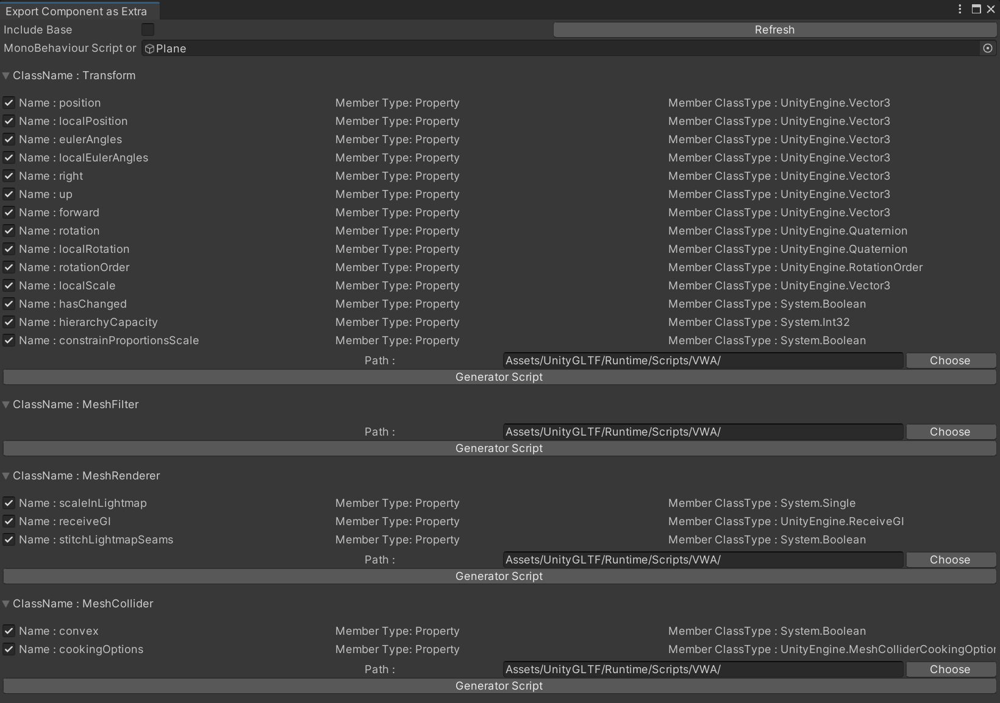
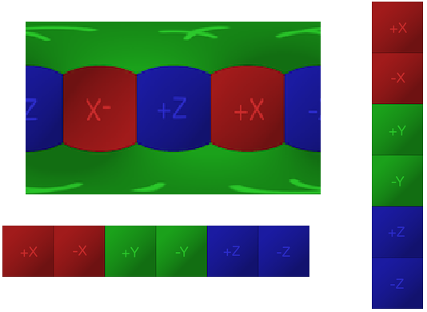
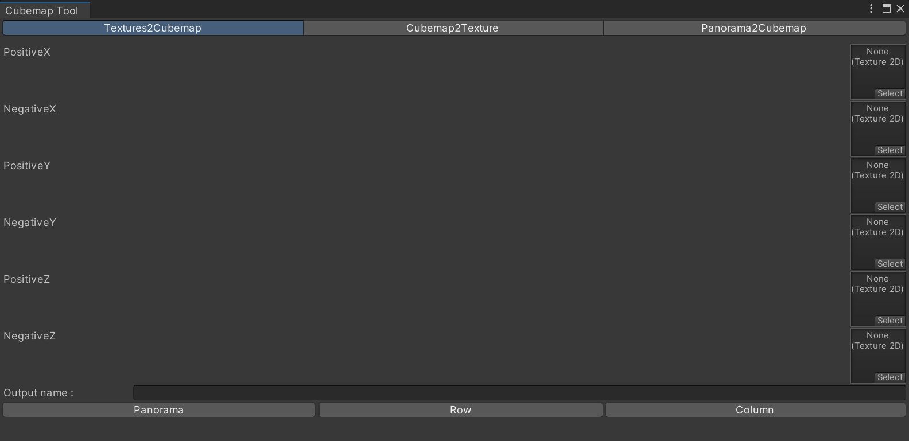
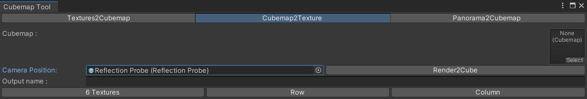

# 工具

### Material Code-Gen（材质生成工具）

允许开发者使用他们自己的着色器。
- 选择材质
- 选择文件夹，必须在工程目录“Assets”中
- 导出并等待编译

> 请保证NormalMap的被正确识别出来了，因为导出NormalMap的时候需要一个特殊的颜色变换
> 使用Attribute利用反射自动处理必要的导入导出入口，不需要再额外添加任何的代码，如果有特殊的关键字处理需求，可以在MaterialImporter里添加实现

[查看本文，了解如何使用生成的代码](MaterialExtra.md)

### Component Code-Gen（代码生成工具）

- 选择一个物体到工具栏, 然后选择对应的组件
- 或者直接将脚本拖拽上去
- 选择工程目录Assets里面的一个位置进行存放生成的脚本
- 导出然后等待编译

  
> 支持的基本导出类型 - bool,byte,short,ushort,int,string,float,double,decimal,LayerMask,Vector2,Vector3,Vector4,Rect,Quaternion,Color,Texture,Material,Sprite,AnimationCurve
> 可序列化的类或结构体
> 基本导出类型的数组或者List
> 可序列化的类或结构体的数组或者List，但是目前只支持一层嵌套
> 使用Attribute利用反射自动处理必要的导入导出入口，不需要再额外添加任何的代码，如有报错可以手动修改，组件会自动在加载Node（即GameObject）的时候进行添加

[Check this out to know how to use the generated code.](ComponentExtra.md)

### Cubemap Converter（Cubemap贴图转换）

- Texture2Cubemap (转换六张 `1:1` 的贴图到一个贴图上(row,column,panorama 3中模式都支持))
- Cubemap2Texture (转换cubemap到6张贴图或者到一张贴图上, 也可以直接将`ReflectionProbe`上捕捉输出到贴图)
- Panorama2Cubemap (`2:1 360 degree` 贴图可以设置方向)

> **The common texture types**
> 

> **Texture->Cubemap**  -  选择六个不同方向的 `Texutre`.

> **Panorama->Cubemap**  -  选择一个 `Panorama Texutre`.
> 

> **Cubemap->Texture**  -  选择一个 `Cubemap` 或者 `Reflection Probe`.
> 

### Texture Converter（贴图转换格式，降分辨率工具）

- 降低分辨率
- 转换格式为 (png,jpeg,tga,exr)

### Enforce Avatar T-Pose（强制Avatar T-Pose）

手动强制化身为“T-Pose”状态，当导出“Humanoid”化身时，“T-Pose”状态是必须的，否则导入播放动画将会异常。通常在导出人形模型时，需要先停止所有的动画，并将其设置为T-Pose状态。