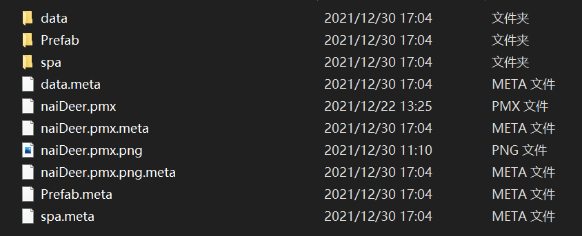
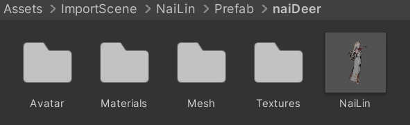
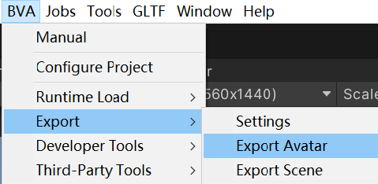
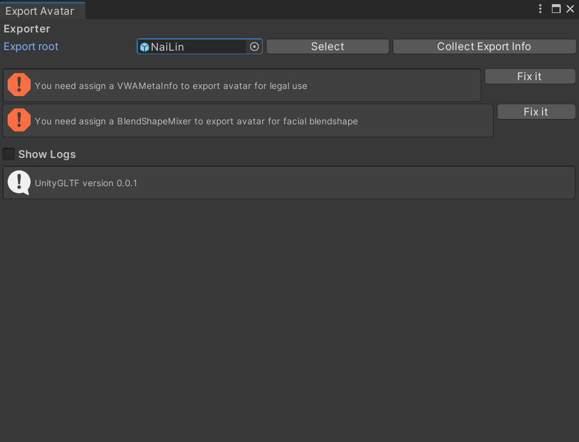
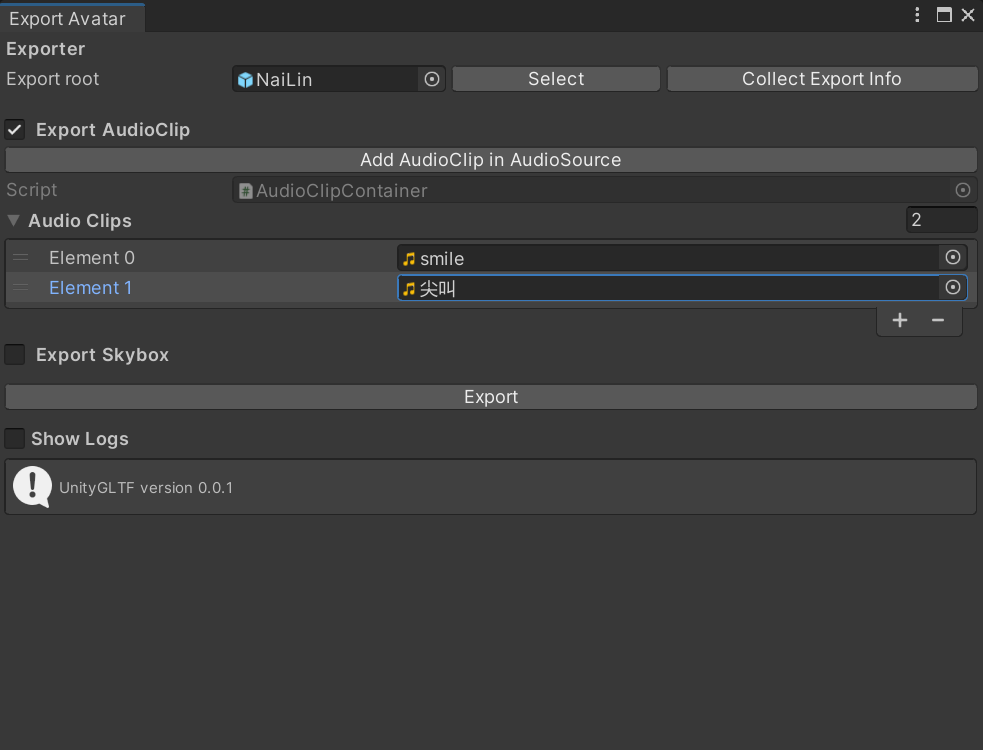
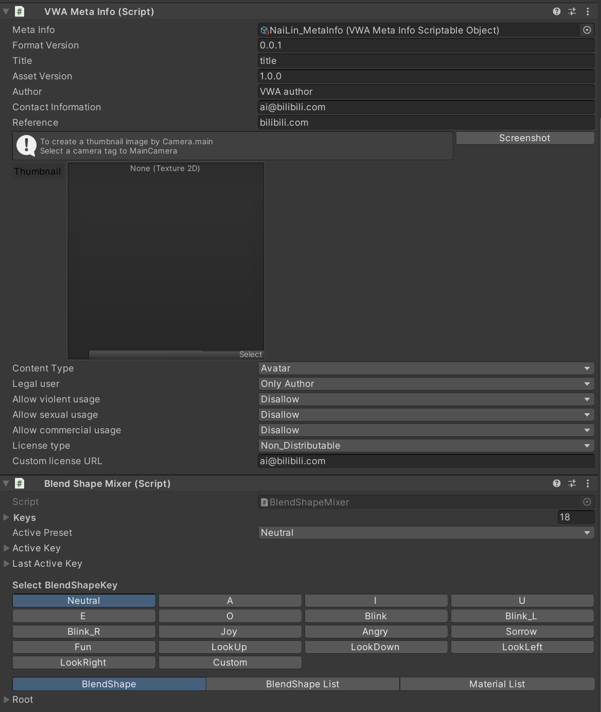

# Avatar Export
In this Example, we will import widely used format PMX(MMD model), then export it as our Avatar.

**Fundamentally, any kind of skinned mesh with a valid `Humanoid Avatar` can be exported as Avatar.**

### Steps:

1. Create a folder, name "ImportScene" in the Assets folder
1. Copy all the PMX and related files into Assets/ImportScene 

1. After processing, a Prefab folder will be created, and a prefab with the same name of pmx file will show up in the project view.

1. Open the BVA/Export/Export Avatar from the Menu

1. Assign the prefab to Export root, two errors will show up as flowering,click Fix it in turn to fix all the errors 

1. Toggle the Export AudioClip, here I want to export two audio clips 

1. Click the prefab, you will notice two component has Added to the GameObject, note that if you assign the Export root from Scene GameObject, these components should also added. Fill the contents as long as you can to optimize our asset.

1. Click `Export` button and select the folder you want to save on the disk.

### Explains:
1. The `BlendshapeMixer` Component let the the face capture work by aggregating the mesh's blendshapes.
1. The `BVAMetaInfo` Component contains the meta info which provide file description but no functional impact.