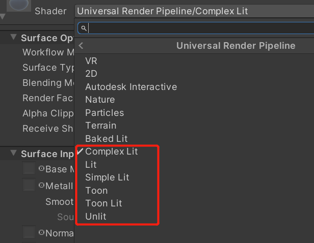
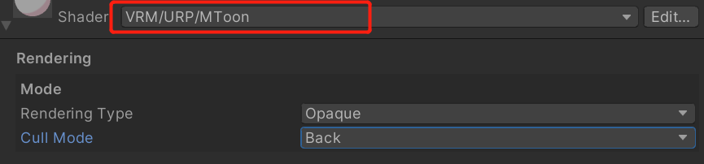
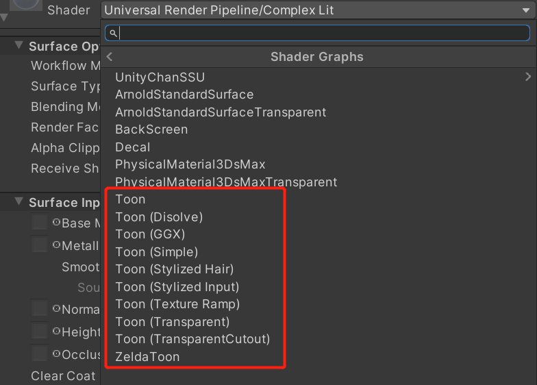
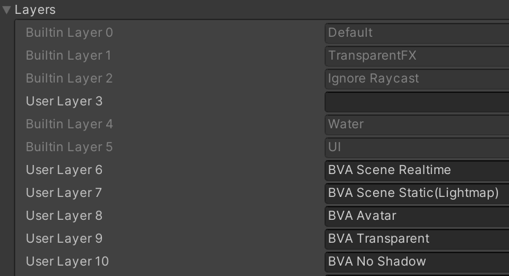

# Export

## Premise

Make sure that `Platform` is set to `Windows,Mac,Linux` in `Build Settings`. Exporting `Cubemap` or `Lightmap` on other platforms may have Texture errors.

## File Format

- GLTF
- GLB

The GLB file encapsulate all of the elements, including animations, materials, node hierarchy and cameras in one single file. In comparison, the GLTF file requires external files, such as for textures data. For more info about gltf, check this [link](https://www.khronos.org/registry/glTF/specs/2.0/glTF-2.0.html).

## Usage Scenarios

- [Avatar](./Avatar.md)
- [Scene](./Scene.md)

Avatar export with extra information such as BlendShape, MetaInfo, and should export only one Humanoid Model at once. This ensure exported avatar can be used in Streaming or Gaming.

## Supported Material

These materials (shaders) supported by BVA

- [Lit](material/Lit.md)
- [Complex Lit](material/ComplexLit.md)
- [Unlit](material/Unlit.md)
- [Skybox](material/Skybox.md)
- [UTS2](https://github.com/unity3d-jp/UnityChanToonShaderVer2_Project)
- [LiliumToonGraph](https://github.com/you-ri/LiliumToonGraph)
- [MToon(URP版本)](https://vrm.dev/univrm/shaders/shader_mtoon.html)
- [ZeldaToon](https://github.com/ToughNutToCrack/ZeldaShaderURP2019.4.0f1)
- ToonLit(Toony Lit shader)

For custom shader, we implement a code-gen tools, so you can select shader parameters that you want to Export & Import, then generate code to import and export material information. 

> All custom material information stores in extras, and will export `KHR_materials_unlitExtension` under the material.

To compatible with standard gltf parameter, material with these parameters will export as standard gltf material parameters.

|     Type     | Parameter   | 
|--------------|-----------|
|**BaseColor**   | `{ "_BaseColor", "_Color", "_MainColor" }`      | 
|**BaseMap**       | `{ "_BaseMap", "_MainTex", "_BaseTexture", "_MainTexture" }`      | 
|**NormalMap**  | `{ "_BumpMap", "_NormalMap", "_DetailNormalMap", "_BumpTexture", "_NormalTexture", "_BumpTex", "_NormalTex" }`        |
|**EmissionMap** | `{ "_EmissionMap", "_EmissionTex", "_EmissionTexture" }`        | 
|**OcclusionMap** | `{ "_OcclusionMap", "_OcclusionTex", "_OcclusionTexture" }`        | 
|**Metallic** | `{ "_Metallic", "_MetallicFactor" }`        | 
|**Smoothness** | `{ "_Smoothness", "_SmoothnessFactor" }`        | 
|**Roughness** | `{ "_Roughness", "_RoughnessFactor" }`        | 
|**MetallicGlossMap** | `{ "_MetallicGlossMap", "_SpecGlossMap", "_GlossMap", "_SpecularMap" }`        | 

> NormalMap must follow naming rules, Because `Unpack` is required when exporting. See how https://docs.unity3d.com/Manual/StandardShaderMaterialParameterNormalMap.html

> To decrease the shader variants, we highly recommend that you only use `Exponential Squared` mode as the only fog mode.

## MMD Model Convert

Since the MMD model's body and head and all the vertices are on a mesh, the blendshape on head will take effect on all vertices, this can result in very large output files, which can seriously affect the efficiency of exporting and loading. 

Therefore, before exporting MMD, the vertices affected by BlendShape will be separated to form a Submesh.This significantly reduces the size of the exported file, comparable to the size of the MMD file itself.

## GameObject Layer
Layers on Render are exported, ensuring that Layer can be correctly distinguished by cameras, lights, and other components.

