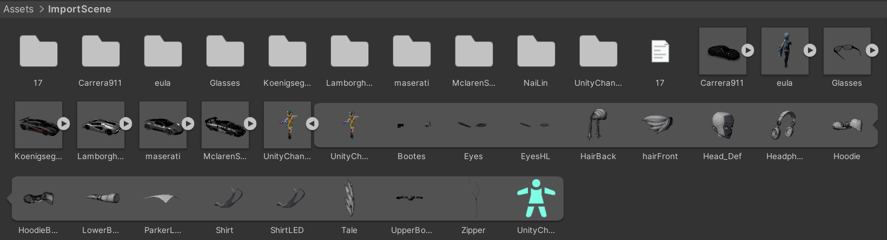
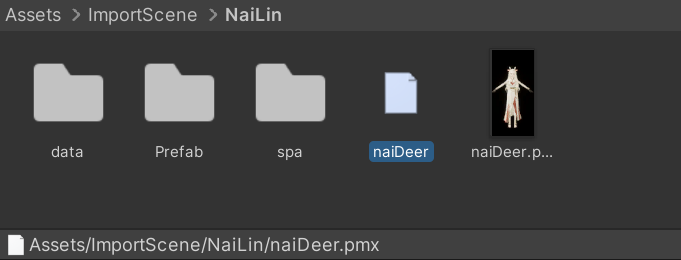
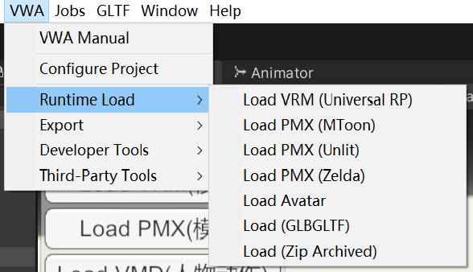

## 支持导入的类型

- 所有类型的BVA文件同样是可以被视为标准的GLTF文件, 所以所有的glb或gltf文件也能被导入
- VRM 文件(.vrm)
- MMD 模型文件(.pmx)

如您所见，除了标准的gltf兼容文件外，我们还添加了VRM和MMD文件的支持，由于历史原因，已经有大量的动漫模型资源被社区创建。

## 导入GLB

拖拽GLB文件到工程的Assets文件夹, 纹理、材料、音频将作为单独的文件导入，其他文件（如网格、动画、化身）将把数据保存在glb文件中。glb文件本身可以用作不可变预设。

## 导入VRM

将VRM文件拖动到Assets文件夹中，纹理、材质、网格、Avatar和所有相关资源将作为单独的资源导入。将创建一个名为VRM的预制件。

## 导入MMD模型

MMD模型文件引用了外部纹理文件，因此必须将包含相关纹理的整个文件夹复制到项目资源文件夹中，纹理、材质、网格、化身、所有相关资源作为单独的资源导入。并创建与pmx文件同名的预制体。

## 运行时导入

可以直接从Editor的菜单上载入模型，不过在此之前得先点击`Play`

