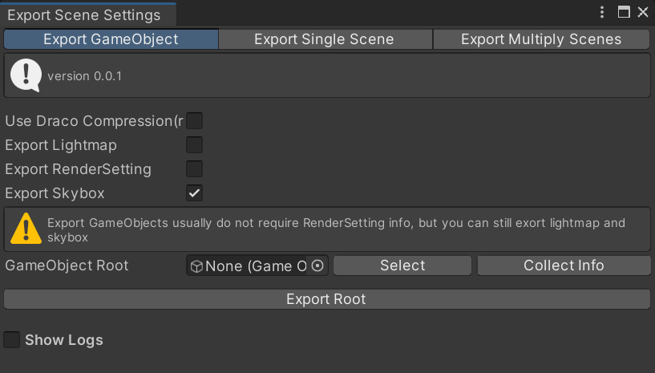
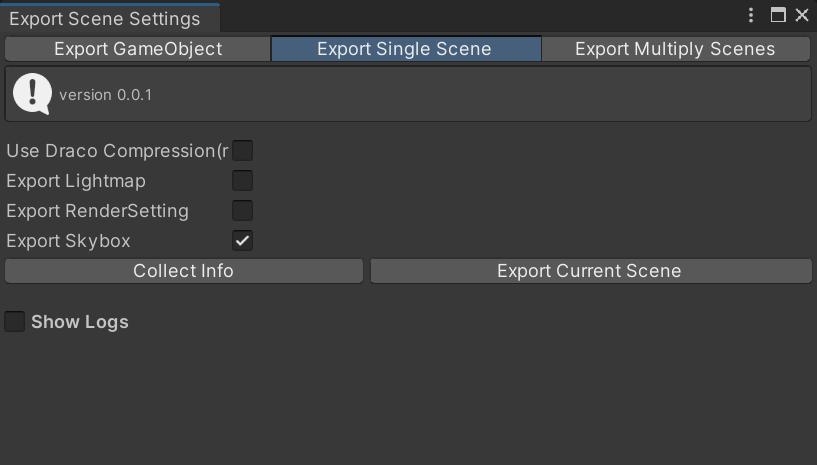
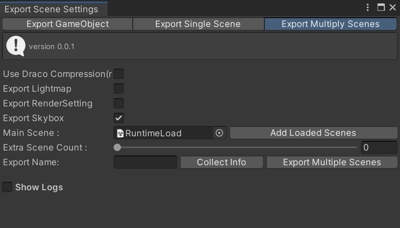
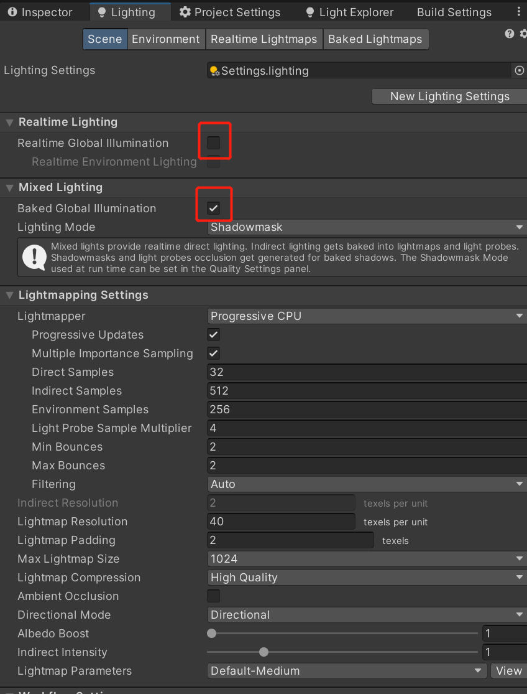
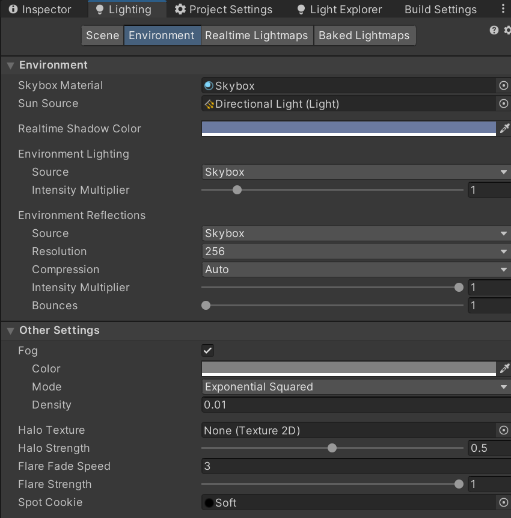

# Scene Export

## Export inside editor supports all features. Three types exporting method

1. Export Root GameObject with all its childs

1. Export Single Scene

1. Export Multiple Scene

## Settings
- NonSkin Mesh(mesh renderered by `MeshRenderer` instead of `SkinnedMeshRenderer`) can apply [google draco](https://github.com/google/draco) compression.It is intended to improve the storage and transmission of 3D graphics.

- When you try to export a scene with baked lighting. Lightingmap will be created in your project. To correctly export lightmap, make sure toggele off the `Realtime Global Illumination`,and Turn on the `Baked Global Illumination` at `Lighting` setting panel.

- RenderSettings contains some global settings, which can access from static class `UnityEngine.RenderSetttings`, most of info can also altered by hand through `Environment` tab on `Lighting` panel

- To decrease the shader variants, we highly recommend that you only use `Exponential Squared` mode as the only fog mode. This can be modified in `PlayerSetting/Graphics` Tab.

- Skybox export