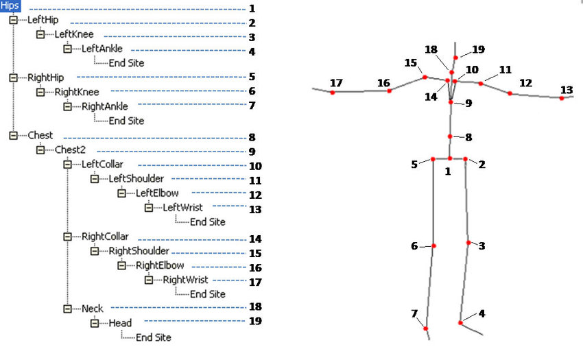

# BVH Animation

## Overview
The Biovision Hierarchy (BVH) character animation file format was developed by Biovision, a defunct motion capture services company, to give motion capture data to customers. This format largely displaced an earlier format Biovision providing skeleton hierarchy information as well as motion data.

## BVH loader
By third-party library [UniHumanoid](https://github.com/ousttrue/UniHumanoid).

### Principle

By Animating a invisible Avatar, and then transfer its human pose to another Avatar.

### BVH resources
http://mocapdata.com/