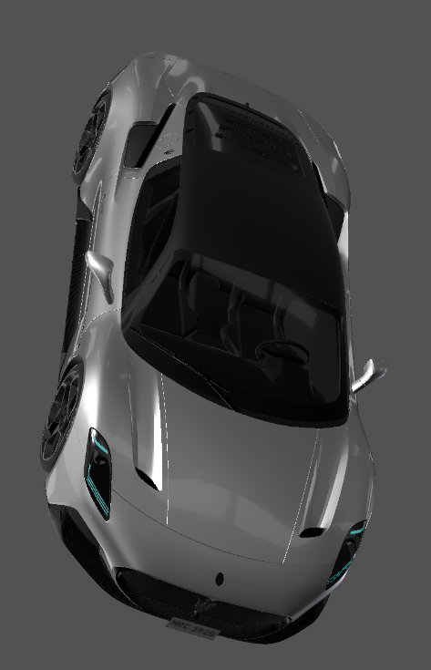

# ComplexLit Shader

## Add `clearcoat` support in comparsion with `Lit` shader. 

> Material information store in `KHR_materials_clearcoatExtension`.

`clearcoatFactor` & `clearcoatRoughnessFactor` is ready to use.

`clearcoatTexture` is not fully compatible with official implementation, but still works fine on Unity with this SDK.

The Clearcoat property is an additional specular layer that is applied on top of a material. An example of this in effect is when a car is painted, and the paint acts as the additional layer. 

