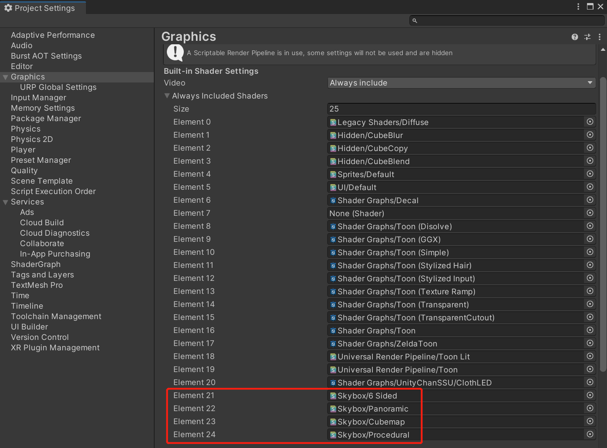

# Skybox Shader

Unity provides multiple Skybox Shaders for you to use. Each Shader uses a different set of properties and generation techniques. Each Shader falls into one of the following two categories:

> Textured: Generates a skybox from one or multiple textures. The source textures represent the view of the background from all directions. The Skybox Shaders in this category are:

- `6 Sided`
- `Cubemap` (Doesn't work on mobile platform)
- `Panoramic`

> Procedural: Does not use textures and instead uses properties on the Material to generate a skybox. The Skybox Shader in this category is:

- `Procedural`

Looking for details : https://docs.unity3d.com/Manual/skybox-shaders.html

> Notice : Don't forget including shaders in `Graphics` 

