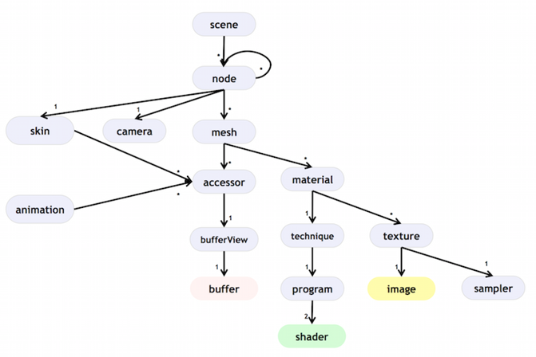

# Mesh

## Format
- Uncompressed
- Compressed (Draco)

## Coordinate System
GLTF2 uses the right-hand coordinate system of Y-UP as its specification. In the right-hand coordinate system, + is the front, but VRM is facing -Z, which is not compatible with the GLTF2 model. This is a result of focusing only on Unity's left-hand coordinate system input and output, and not on converting the coordinate system. For the compatible of GLTF standardization, the importer and exporter converted the coordinate system.

This process cost most of time when constructing a mesh, and mainly responsible for the performence intensity.To fix this issue, we introduce a multi-thread load method, that is to prepare the data that required by constructing mesh and load image in main thread simultaneously. The result shows that all this efforts are worthwhile.usually these two different operations were took very similar amount of time. Basiclly doubled the loading performence, and we abandoned the recursive node constructing principle, try our best to seperate the resources initiating process. Now it almost reach the same level of loading performence in comparasion of VRM.

## Scene Specific
Our asset standards are designed to take into account that the resources they contain are not necessarily loaded all at once. That's why we choose to loading all resources recursively. Only in this way, don't we need to create all reference resources that might being used later. The hierachy is as follows.

## Avatar Specific
To increase the compatibility of humanoid models, the following constraints are imposed:
- Model is placed at the origin
- Model faces towards -Z direction1
- Model hierarchy is Y-UP2
- Model mesh is Y-UP2
- Model hierarchy is T-Pose
- Model mesh is T-Pose
- No local rotation for bone
- No scale for bone
- Head bone faces front direction3

And to increase the performence, a loading mechanism completely different from scene loading is introduced:
- Texture loading and mesh data conversion are working parallelly.
- ~~`recursive loading`~~ method are replaced by `phased loading`.